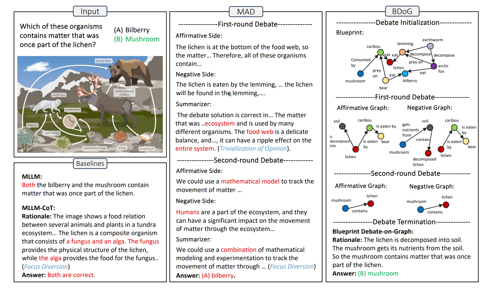
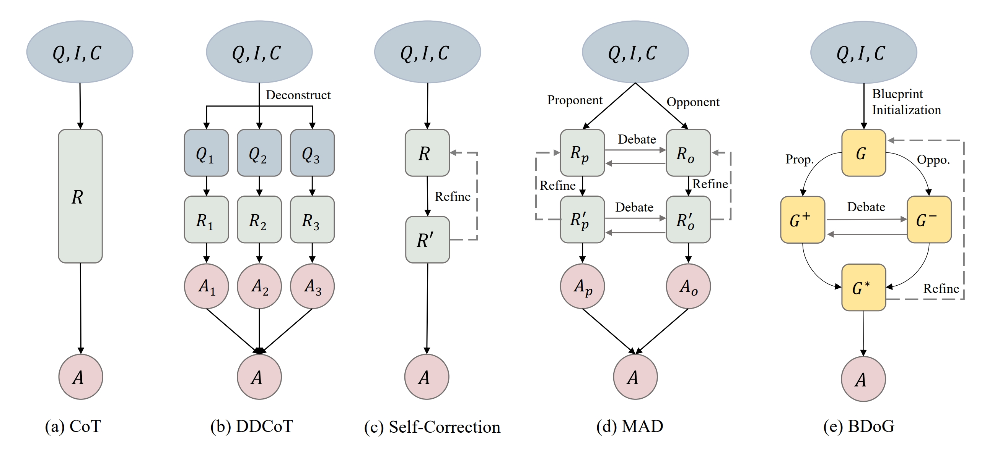

<h3 align="center"><a href="https://arxiv.org/pdf/2403.14972" style="color:#9C276A">
A Picture Is Worth a Graph: Blueprint Debate on Graph for Multimodal Reasoning</a></h3>
<h5 align="center">

[](https://arxiv.org/pdf/2403.14972)

</h5>




 Blueprint Debate-on-Graph (BDoG)


## 🔥News

- __[2024.08]__ 


## 🚀 Method



## 🏗️ QuickStart
### 1. Installation
```bash
git clone https://github.com/thecharm/BDoG.git
cd BDoG
pip install -e .
```
### 2. Download model weights
Download the [model weights](https://huggingface.co/Salesforce/instructblip-vicuna-13b) and set the model path in the `BDoG/vlmeval/config.py` file


### 3. Running
```
torchrun --nproc_per_node=1 run.py --data ScienceQA_TEST \
                                   --stage BDebate \
                                   --debate 2
```
+ `--data` 
  + Dataset supported: `ScienceQA_TEST` and `MMBench_DEV_EN`.
+ `--stage` 
  + Prompt Type: `BDebate`(Blueprint Debate on Graph) or `ODebate`(Debate without Graph).
+ `--debate` 
  + Number of rounds for the debate.
+ `--kg_init` 
  + (optional) Use Gemini Graph as the initialization for multi-round debates.
+ `--nproc_per_node=2` 
  + (optional) Speed up the inference process if you have two GPUs.
+ `--openai`
  + (optional) Use the Openai API key to perform the final result validation.

The results are saved in the `BDoG/results/instructblip_13b` folder.

During this process, the datasets will be automatically downloaded to the `/root/LMUData/` directory. If you need to change the data storage path, please reset `--lmudata`.

## 📑 Citation

If this repo is useful to you, please cite using this BibTeX.
```bibtex
@misc{zheng2024pictureworthgraphblueprint,
      title={A Picture Is Worth a Graph: Blueprint Debate on Graph for Multimodal Reasoning}, 
      author={Changmeng Zheng and Dayong Liang and Wengyu Zhang and Xiao-Yong Wei and Tat-Seng Chua and Qing Li},
      year={2024},
      eprint={2403.14972},
      archivePrefix={arXiv},
      primaryClass={cs.AI},
      url={https://arxiv.org/abs/2403.14972}, 
}
```