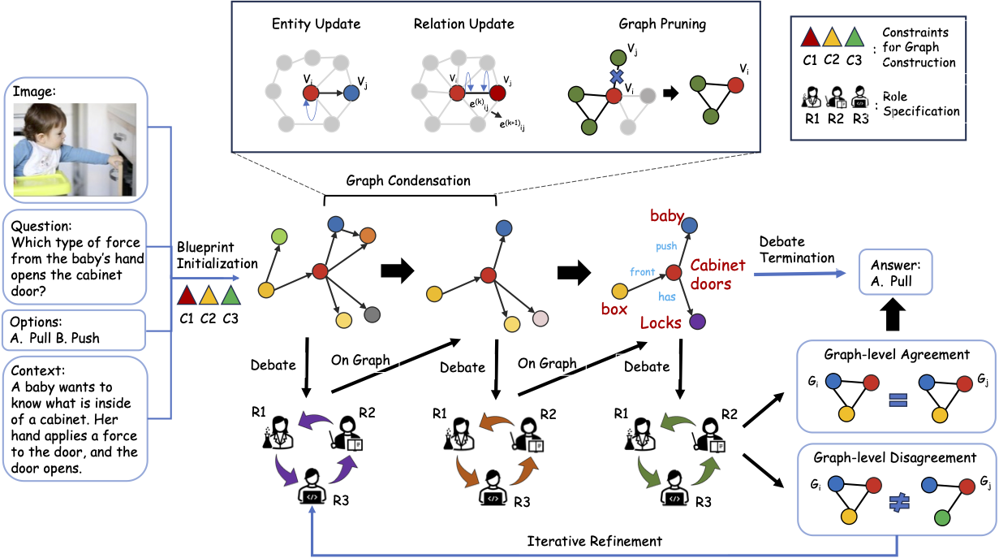

<div align="center">

# <b>A Picture Is Worth a Graph</b>: A Blueprint Debate Paradigm for Multimodal Reasoning

[Changmeng Zheng](https://github.com/thecharm)<sup>1</sup>, [Dayong Liang](https://github.com/YongLD)<sup>2</sup>, [Wengyu Zhang](https://github.com/zhangwengyu999)<sup>1</sup>, [Xiao-Yong Wei](https://scholar.google.com/citations?user=8kxWTokAAAAJ&hl=en)<sup>*,1</sup>, [Tat-Seng Chua](https://scholar.google.com.sg/citations?user=Z9DWCBEAAAAJ&hl=en)<sup>3</sup>, [Qing Li](https://scholar.google.com/citations?user=D1LEg-YAAAAJ&hl=en)<sup>1</sup>

<p><sup>1</sup>The Hong Kong Polytechnic &nbsp;&nbsp;<sup>2</sup>South China University of Technology &nbsp;&nbsp;<sup>3</sup>National University of Singapore
<br><sup>*</sup>Corresponding author &nbsp;&nbsp;
<h5 align="center">

[](https://arxiv.org/pdf/2403.14972)

</h5>


 Blueprint Debate-on-Graph (BDoG)

## 🔥News

🔥 __[2024.10]__ Our paper has been nominated as the best paper award!\
🔥 __[2024.07]__ The paper and Code are released!

## 🚀 Method


</div>

## 🏗️ QuickStart
### 1. Installation
```bash
git clone https://github.com/thecharm/BDoG.git
cd BDoG
pip install -e .
```
### 2. Download model weights
Download the [model weights](https://huggingface.co/Salesforce/instructblip-vicuna-13b) and set the model path in the `BDoG/vlmeval/config.py` file


### 3. Running
```
torchrun --nproc_per_node=1 run.py --data ScienceQA_TEST \
                                   --stage BDebate \
                                   --debate 2
```
+ `--data` 
  + Dataset supported: `ScienceQA_TEST` and `MMBench_DEV_EN`.
+ `--stage` 
  + Prompt Type: `BDebate`(Blueprint Debate on Graph) or `ODebate`(Debate without Graph).
+ `--debate` 
  + Number of rounds for the debate.
+ `--kg_init` 
  + (optional) Use Gemini Graph as the initialization for multi-round debates.
+ `--nproc_per_node=2` 
  + (optional) Speed up the inference process if you have two GPUs.
+ `--openai`
  + (optional) Use the Openai API key to perform the final result validation.

The results are saved in the `BDoG/results/instructblip_13b` folder.

During this process, the datasets will be automatically downloaded to the `/root/LMUData/` directory. If you need to change the data storage path, please reset `--lmudata`.

## ❤️ Acknowledgments
- [VLMEvalKit](https://github.com/open-compass/VLMEvalKit): An open-source evaluation toolkit of large vision-language models (LVLMs).
- [LLaVA](https://github.com/haotian-liu/LLaVA): Wounderful MLLM based on Large Language and Vision Assistant.
- [LAVIS](https://github.com/salesforce/LAVIS): The amazing open-sourced multimodality learning codebase.


## 📑 Citation

If this repo is useful to you, please cite using this BibTeX.
```bibtex
@inproceedings{zheng2024picture,
  title={A Picture Is Worth a Graph: A Blueprint Debate Paradigm for Multimodal Reasoning},
  author={Zheng, Changmeng and Liang, DaYong and Zhang, Wengyu and Wei, Xiaoyong and Chua, Tat-Seng and Li, Qing},
  booktitle={ACM Multimedia 2024}
}
```
